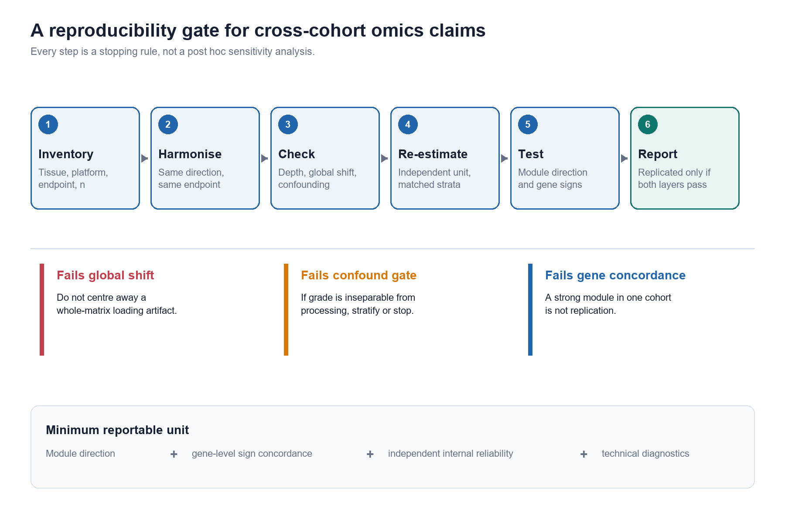
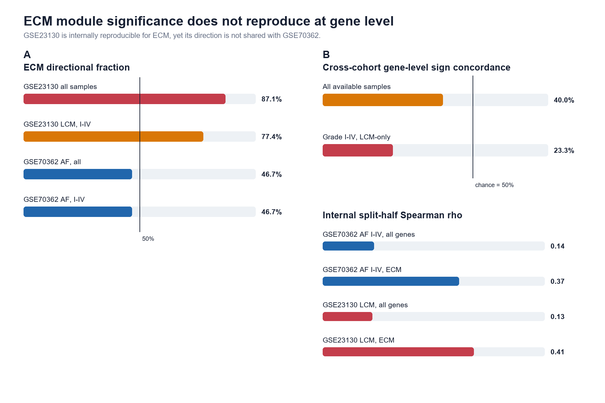
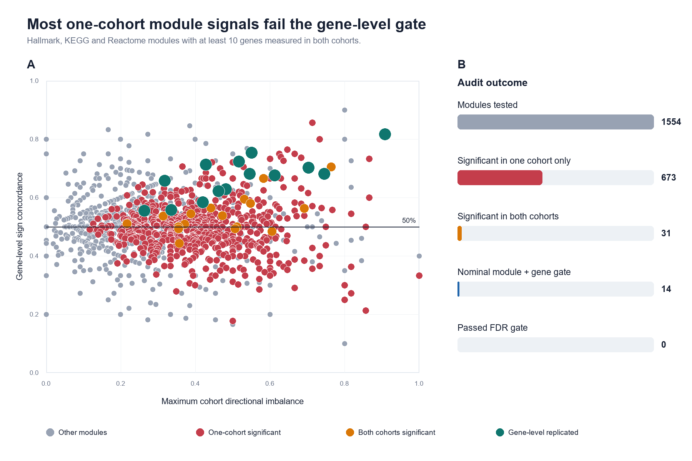
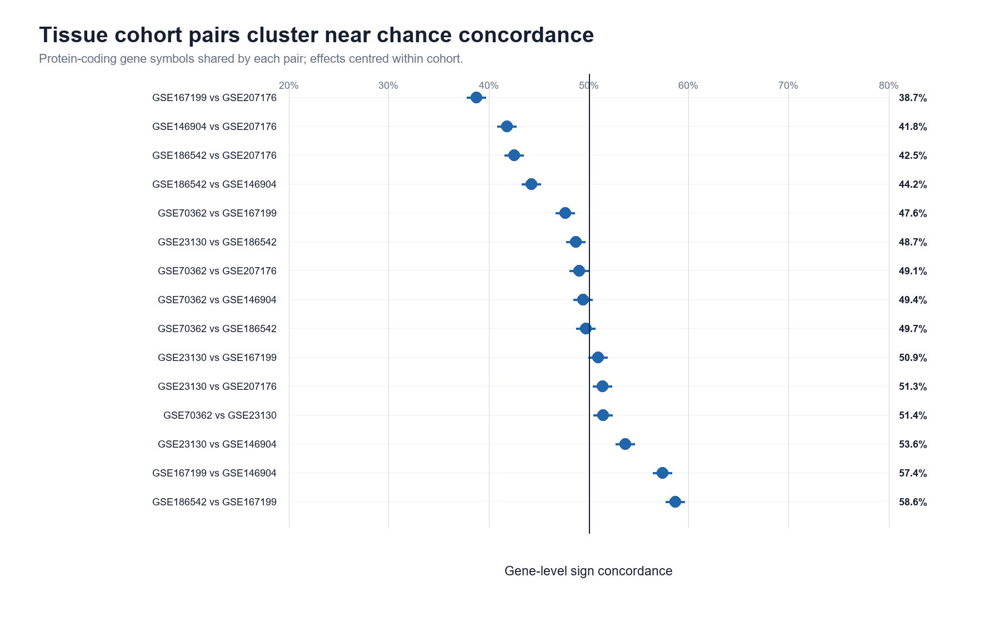
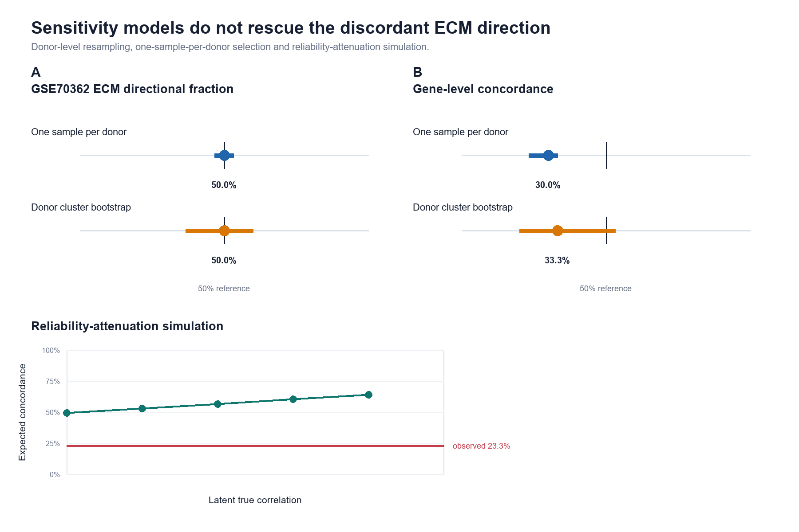

# 模块层面一致不等于复制：公共人椎间盘转录组的报告与可复现性门槛

## 摘要

**背景。** 椎间盘（intervertebral disc，IVD）领域的公共转录组再分析，常把某一模块在单个队列中显著，或在不同队列中方向相似，解释为可复现性证据。这种解释忽略了一个可能性：两个队列中的模块方向可能由不同的基因子集驱动。

**方法。** 我们审计了 6 个公开的人椎间盘组织转录组队列，并使用两个最大的分级纤维环队列 GSE70362 和 GSE23130 做匹配分析。我们将“全部可用样本”与严格样本集进行比较，后者限定为 Thompson I–IV 级、纤维环和激光捕获显微切割样本。效应量使用线性模型估计，并校正可获得的技术变量。对于每个基因集，我们报告各队列中的模块方向、精确检验和置换检验 p 值，以及两队列间的基因级符号一致率。我们还审计了 1,554 个 Hallmark、KEGG 和 Reactome 模块，以及 15 对组织队列。队列内部可复现性使用重复分层 split-half 分析评估；对于可提供供者 ID 的 GSE70362，加入供者级单样本和 cluster bootstrap 评估供者内非独立性，而 GSE23130 未提供供者 ID。解释结果前，还进行了全局漂移、处理混杂、多重检验和可靠性衰减检查。

**结果。** 在严格比较中，GSE23130 的 ECM 重塑模块有 77.4% 的基因上调，符号检验 p = 0.0017；GSE70362 仅 46.7% 的基因上调，p = 0.7077。两队列的基因级方向一致率为 23.3%，双侧精确符号检验 p = 0.0052，在主规则下低于独立方向下预期的 50%。替代探针折叠规则也未超过 50%，但低于随机的幅度并不稳健，随机探针选择的一致率中位数为 36.7%。供者级重采样后，GSE70362 的 ECM 上调比例中位数仍接近 50%，跨队列一致率中位数约为 30%。ECM 模块在两个队列中均有中等程度的内部可靠性，split-half Spearman rho 分别为 0.37 和 0.41。队列内部 cross-half 阳性对照的中位一致率为 63.3% 和 64.5%，高于跨队列的 23.3%。但 power 校准显示，在潜在相关为 0.6 时，名义 30 基因检验也只有 20.4% 的 power。因此，这一结果是“未能建立复制”，而不是“共享生物学不存在”的证据。1,554 个模块中，673 个仅在单队列显著，31 个在双队列显著；14 个在名义 p 值下通过额外的基因级一致门槛，但经过精确符号检验 FDR 后为 0 个。别名感知敏感性将模块数扩大到 1,572、名义基因级结果增加到 15，但严格 FDR 结果仍为 0。phenotype permutation 和表达匹配零模型作为敏感性分析保留。15 对椎间盘组织队列的中位基因级符号一致率为 49.4%，最高为 58.6%。定向检索后仍未发现符合 Tier A 标准的第三个纤维环严重度队列。在包含 95 篇开放获取椎间盘转录组文章的 scoping 语料中，79 篇使用了多于一个 GSE，62 篇在多队列分析中使用了“一致”类措辞，而没有文章按照预先设定的文本标准描述基因级一致率。

**结论。** 在公共人椎间盘转录组中，模块层面显著并不能建立跨队列复制。可复制的声明需要同一个预设基因集在独立队列中实现基因级同向变化，而不仅是模块方向相似。
我们将这一区分操作化为五层声明阶梯，从单队列探索性信号一直到通过 FDR 控制的基因级复制。

**关键词。** 可复现性；转录组学；生物信息学；基因集；椎间盘

## 意义陈述

公共数据转录组研究常缺少足够的独立队列来完成生物学复制，但多队列研究仍频繁使用“一致”类措辞。本审计显示，一个模块可以同时具有强显著性和内部可复现性，却在跨队列基因级一致率上失败。实用建议很简单：同时报告模块方向和基因级符号一致率，单独任何一层都只能作为产生假设的证据。

## 引言

椎间盘退变研究依赖许多小型人类转录组队列，这些队列在组织部位、RNA 处理方式、平台、退变分级和临床终点上存在差异。在包含 95 篇开放获取椎间盘转录组文章的 scoping 语料中，79 篇使用了多于一个 GSE，62 篇在多队列分析中使用了“一致”类措辞，而没有文章按照预设文本标准描述基因级一致率。因此，再分析可能通过引用一个数据集中的显著富集和另一个数据集中的方向相似结果，来支持某条通路或模块，却没有展示同一批基因是否复制。其他领域的跨组学与预后签名审计也显示，名义上的基因集重现和看似良好的区分能力，可以与有限的基因级重叠，或与适当零模型无法区分的表现同时存在 [1,2]。这些问题也与长期的研究有效性分析 [3] 以及系统复制项目一致，后者发现多数复制效应量小于原始估计 [4]。Open Science Collaboration 同样发现复制效应量约为原始效应量的一半 [5]。

这一论证存在盲点。一个模块可能富集，是因为队列 A 中 80% 的基因向一个方向变化，队列 B 中 55% 的基因向同一方向变化，但真正驱动信号的基因在两个队列中并不相同。模块成员关系不能证明同一生物学程序被激活。基因级符号一致率是缺失的检查。转录组方法学基准进一步表明，逐基因的边缘选择会受到共表达结构的偏倚，因此模块聚合不能替代复制所需的基因级行为 [6]。

因此，我们构建了一个针对公共人椎间盘转录组的可复现性审计（图 1）。审计提出四个问题。第一，被比较的样本是否测量同一组织和终点？第二，全局漂移、处理混杂或检测深度差异能否解释表面效应？第三，模块是否具有内部可复现性？第四，同一批基因是否在独立队列中同向变化？

本审计不是新的通路发现研究，而是一个针对公共数据声明的阴性对照和报告框架。使用的基因集在跨队列比较前已经固定。本文有三个贡献：一个有匹配设计的椎间盘案例、一套可复用的基因级可复现性门槛，以及一套将探索性信号、内部稳定性、情境一致性、候选复制和 FDR 控制复制区分开的声明阶梯。本文的创新不在于新的统计检验或算法，而在于把领域匹配证据、可操作的声明门槛，以及覆盖供者依赖性、探针选择、基因身份、尺度和 FDR 家族结构的敏感性分析整合为一个审计体系。

## 方法

### 数据来源

我们使用分析工作区中已存在的公共人椎间盘组织队列。主要分级比较使用 GSE70362（纤维环和髓核，Thompson I–V 级）和 GSE23130（纤维环，组织学 I–V 级）。其他组织队列包括 GSE186542、GSE167199、GSE146904 和 GSE207176。可复现性分析不使用血液队列，因为本文关注组织程序的迁移性，而不是血液与组织之间的一般性。GEO 是国际公共数据库，用于归档高通量功能基因组数据的原始数据、处理后数据和 metadata [7]。GSE70362 最初由 Kazezian 等报道 [8]，GSE23130 由 Gruber 等报道 [9]，GSE167199 由 Li 等报道 [10]。

严格主分析使用 20 个 GSE70362 纤维环 Thompson I–IV 级样本，以及 15 个 GSE23130 激光捕获 I–IV 级样本。全样本比较使用 24 个 GSE70362 纤维环样本和全部 23 个 GSE23130 样本。

### 分析时序与预指定范围

最终置换运行前，我们于 2026-09-16 冻结了内部分析计划，文件为 `Frozen Analysis Plan.md` 和 `docs/analysis_plan_v2.md`。该计划没有进行公开预注册。因此，本文中的“prespecified”指的是最终敏感性分析和声明语言在该次运行前已经固定，并不意味着整个研究是前瞻性、盲法或事先注册的。早期探索影响了队列和终点选择。读者应把本审计理解为带有内部冻结的透明回顾性分析，而不是公开注册的前瞻性研究。

### 数据协调与效应量估计

我们直接解析 GEO series matrix。探针依据平台注释和人类 gene_info 表映射为 Entrez ID 或基因符号。主分析保留平台提供的 symbol；别名感知敏感性进一步通过当前 synonyms 和 nomenclature-authority symbols 映射历史 symbol。当一个基因符号对应多个探针时，主分析保留平均表达最高的探针。敏感性分析还使用首个探针、探针中位数以及重复随机探针选择。

对于每个队列，我们对归一化表达矩阵拟合逐基因线性模型。方向定义为随退变分级增加。严格的 GSE70362 模型包含分级和批次；严格的 GSE23130 模型包含分级和组织来源。全样本 GSE23130 模型还包含处理方法。全样本 GSE70362 模型使用纤维环子集，以减少组织异质性。我们使用自编写的 ordinary least-squares 实现，而不是直接调用 limma；limma 提供了高通量表达数据逐基因线性模型的参考框架 [11]。

分级只作为严格递增的 ordinal score 使用：I = 1，I-II = 1.5，II = 2，III = 3，IV = 4。报告的 direction 是逐基因单调趋势的符号。对同一 grade 顺序进行任何严格递增的重编码，符号都不会改变；系数大小依赖刻度，因此不解释为等间距剂量效应。该分析不检验任意非单调的 grade 差异。

### 可复现性门槛

基因集分析最初用于通过协同变化的基因集合而不是孤立基因来解释全基因组表达谱 [12]。对于每个基因集，我们计算各队列中效应为正的基因比例、中位效应和精确符号检验 p 值。名义模块门槛要求两队列同向显著，并且共享基因的方向一致率高于 50%，p < 0.05。随后我们加入严格门槛：对 1,554 个模块使用精确双侧符号检验和 Benjamini-Hochberg FDR [13]。队列内方向还使用分层标签置换、Freedman-Lane 残差置换和基于旋转的残差零模型评估 [14]。基因一致率使用大小匹配和表达匹配的经验零分布评估。只有通过精确 FDR 门槛的模块才称为 replicated。该门槛不要求所有基因一致，而是检验模块成员关系是否携带可跨队列迁移的信息。

我们将该门槛应用于 7 个预设机制模块，以及至少包含 10 个可测基因的 1,554 个 Hallmark、KEGG 和 Reactome 模块。

声明阶梯的操作定义如下。Level 2 要求两个匹配队列均达到名义同向显著。Level 3（候选基因级复制）还要求共享基因符号一致率大于 50%、精确单侧符号检验 p < 0.05，以及 size-matched 经验零模型单侧 p < 0.05。Level 4（强跨队列复制）要求基于双侧精确符号检验的队列方向检验和基因级一致率检验均通过预设模块家族的 Benjamini-Hochberg FDR 控制。只有达到 Level 4 的模块才在本研究中写作 replicated。

### 技术诊断

我们计算每个队列中不同方向的基因比例和基因效应中位数。方向比例超出 30%–70%，或中位效应绝对值高于 0.2，被标记为可能存在全局漂移。我们交叉列出分级与组织、批次、处理方法和来源。我们没有直接使用 sva；已知的 batch 或 source 变量被纳入设计。sva 框架说明潜在变异可能使高通量实验产生偏倚 [15]。基于 empirical Bayes 的 ComBat 方法处理相关的一类批次效应问题 [16]。GSE23130 的 V 级样本仅存在于匀浆组织中，因此严格分析只保留激光捕获样本。

内部可复现性使用 100 次重复的、按分级分层的 split-half 分析评估。每次重复中，两个半队列独立估计基因效应，并记录两个效应向量的 Spearman 相关。全基因组和 ECM 模块分别报告中位 split-half 相关。

为解决 GSE70362 中同供者样本的非独立性，我们使用每个供者随机选择一个样本，以及供者级 cluster bootstrap，重复 ECM 分析。split-half 可靠性也改为按供者分开，而不是按样本分开。我们根据相关矩阵谱估计 ECM 模块的有效独立基因数，并在大小匹配零模型之外，使用表达匹配的随机基因集。GSE23130 的 metadata 不包含供者 ID，因此无法进行供者级重采样，该队列的残余供者内非独立性不能被排除。有效检验数采用 Li 和 Ji 的基于特征值的方法 [17]。

最后，我们使用 Spearman-Brown 公式由 split-half 相关估计全样本可靠性，并模拟潜在相关从 0 到 0.8 时的预期符号一致率。这用于检验观察到的 23.3% 一致率是否可以完全由可靠性衰减解释。

### 队列对可比性与解释上限

我们按照测量情境的匹配程度对队列对分类。Class A 对在组织部位、终点、处理方法和平台家族上均匹配。Class B 对在组织部位和终点上匹配，但处理方法或平台家族不同。Class C 对在组织部位或终点上不同，只能作为情境比较。

主要的 GSE70362-GSE23130 比较属于 Class B：组织部位和退变分级终点匹配，但平台和处理方法不匹配。由于每个平台只由一个队列代表，平台身份与队列身份在结构上混杂，任何统计模型都无法把平台特异效应与队列生物学完全分离。因此，本审计可以检验预设模块信号能否在观察到的两个队列之间迁移，但不能建立与平台无关的生物学结论。即使某个模块通过 Level 4，这一解释上限仍然存在。MAQC 项目说明不同 microarray 平台在差异表达层面可以具有较高一致性，但这一结果不能解决本文的队列-平台不可识别问题 [18]。

分级因素在队列内部也存在部分不可识别性：某些分级只出现在某一个 source 或 batch 中。因此，校正模型可以减少明显的技术混杂，但不能建立因果性的分级效应，也不能移除全部残余混杂。

### 软件与代码可用性

本审计实现为独立的 Python 项目。所有表格和图形由 `run_audit.py` 重新生成；统计检验使用精确二项尾概率，除 NumPy 和 pandas 外不依赖额外统计库。代码位于项目仓库中。

## 结果

### 队列诊断

| 分析集 | 样本数 | 供者数 | 基因数 | 上调比例 | 中位效应 | 全局漂移 |
|---|---:|---:|---:|---:|---:|---|
| GSE70362 AF，全部级别 | 24 | 18 | 18479 | 47.6% | -0.0027 | 否 |
| GSE70362 AF，I–IV 级 | 20 | 16 | 18479 | 43.6% | -0.0089 | 否 |
| GSE23130，全部处理方式 | 23 | 不适用 | 22107 | 49.7% | -0.0002 | 否 |
| GSE23130 LCM，I–IV 级 | 15 | 不适用 | 22107 | 55.0% | +0.0075 | 否 |
| GSE70362 AF，I–IV 级，仅分级 | 20 | 16 | 18479 | 43.4% | -0.0084 | 否 |
| GSE23130 LCM，I–IV 级，仅分级 | 15 | 不适用 | 22107 | 51.6% | +0.0021 | 否 |

四个主要分析集均未显示全局漂移（表 1）。严格的 GSE70362 和 GSE23130 队列上调比例分别为 43.6% 和 55.0%，中位效应均在 0.01 log 单位以内。因此，剩余的队列间差异不能由矩阵整体载量差异解释。

GSE23130 的供者数列显示为不可用，因为 series metadata 没有提供供者 ID。因此，其 15 个严格样本只能视为样本级测量，不能视为已经验证的独立供者。

分级与处理方法的交叉表说明，为什么未限制的 GSE23130 分析不足以支持复制声明：V 级只存在于匀浆样本中。限制为激光捕获样本后，这一特定混杂被移除，留下 I–IV 级比较。

其余交叉表显示的是部分不可识别，而不是完整的交叉设计。在严格 GSE23130 子集中，I 级只来自 CHTN 样本，IV 级只来自 surgical 样本。在 GSE70362 中，II 级只出现在 batch 1，而 batch 2 不含 III–IV 级。因此，校正模型被解释为混杂变量调整后的关联，而不是完全识别的因果分级效应。仅分级敏感性模型仍维持主要 ECM 跨队列一致率 23.3%（表 S2），并给出相似的方向估计，说明主要审计结论不依赖校正选择。

### ECM 模块显著并不意味着基因级复制

| 比较 | GSE70362 ECM 上调 | GSE23130 ECM 上调 | ECM 基因一致率 | 双侧符号检验 p |
|---|---:|---:|---:|---:|
| 全部可用 AF/LCM 样本 | 46.7% | 87.1% | 40.0% | 0.3616 |
| 严格 I–IV 级 AF/LCM，校正模型 | 46.7% | 77.4% | 23.3% | 0.0052 |
| 严格 I–IV 级 AF/LCM，仅分级 | 50.0% | 74.2% | 23.3% | 0.0052 |

在全样本比较中（表 2），ECM 模块在 GSE23130 中显著为正，87.1% 基因上调，p = 1.697661×10⁻⁵；在 GSE70362 中不存在，46.7% 上调，p = 0.7077。基因级一致率为 40.0%，没有证据表明其高于随机。

严格 I–IV 级激光捕获比较保留了这一矛盾。GSE23130 仍然为正，77.4% 上调，p = 0.0017；GSE70362 在基因级仍不可复现。跨队列一致率为 23.3%，双侧精确符号检验 p = 0.0052。因此，同一模块在一个队列中是强结果，在另一个队列中却是非一致的方向匹配（图 2）。

预设的最高均值探针规则得到 23.3% 的 ECM 一致率，双侧精确 p = 0.0052。探针折叠敏感性分析中，首个探针得到 30.0%，探针中位数得到 33.3%，100 次随机探针选择的一致率中位数为 36.7%（2.5–97.5%：23.3–48.4%）。没有任何规则超过 50%，但低于随机的显著性并不稳健（表 2，表 S23）。因此可辩护的结论是“未超过随机水平”，而不是存在统计显著的负一致。

尺度不变的 rank-trend 分析同样不支持跨队列一致。未调整的基因级 Spearman trend 得到 33.3% ECM 一致率（p = 0.0987），按 batch 或 source 分层平均后得到 36.7%（p = 0.2005）。在分层 rank-trend 中，GSE23130 仍保持正向 ECM 信号（74.2% 上调，p = 0.0053），而 GSE70362 仍无方向性（53.3% 上调，p = 0.4278）。因此结果仍低于 50%，但没有显著低于随机的证据（表 S25）。

内部 split-half 分析显示，两个严格数据集均具有中等程度的基因级可靠性，ECM 模块的中位 Spearman rho 分别为 0.37 和 0.41（表 S3）。这排除了 GSE23130 只是纯噪声的最简单解释。现有证据支持“未能建立跨队列基因级复制”，而不是“两个患者群体的生物学程序存在本质差异”。

供者级敏感性分析保留了阴性结果（表 S7，图 5）。

| 敏感性模型 | 重复次数 | 上调比例 | 上调 2.5% | 上调 97.5% | 一致率 | 一致率 2.5% | 一致率 97.5% | 效应 rho |
|---|---:|---:|---:|---:|---:|---:|---:|---:|
| 供者 cluster bootstrap | 300 | 50.0% | 36.7% | 60.0% | 33.3% | 20.0% | 53.3% | -0.450 |
| 每供者一个样本 | 300 | 50.0% | 46.7% | 53.3% | 30.0% | 23.3% | 33.3% | -0.498 |

ECM 模块的有效独立基因数较低，在 GSE70362 中为 6.8，在 GSE23130 中为 5.9（表 S9）。因此我们没有将普通二项符号检验作为最终检验。表达匹配零模型给出的主 ECM 比较经验下尾概率为 0.0046（表 S10）。

可靠性衰减不能解释这一结果（表 S8，图 5）。在观察到的 split-half 可靠性下，零潜在相关时模拟一致率仍接近 50%，而观察值为 23.3%。观察到的 ECM 效应量相关为 -0.495，去衰减后为 -0.884。

| 潜在相关 | 预期一致率 | 2.5% | 97.5% |
|---:|---:|---:|---:|
| 0.0 | 50.0% | 33.3% | 66.7% |
| 0.2 | 53.5% | 36.7% | 70.0% |
| 0.4 | 57.1% | 40.0% | 73.3% |
| 0.6 | 60.8% | 43.3% | 76.7% |
| 0.8 | 64.6% | 46.7% | 80.0% |

结果并不只出现在未加权符号指标中（表 S12）。

| 指标 | 数值 |
|---|---:|
| 未加权符号一致率 | 23.3% |
| 效应量加权一致率 | 24.2% |
| 前半强效应基因一致率 | 26.7% |
| 效应量 Spearman rho | -0.495 |

队列内部 cross-half 分析提供了阳性对照（表 S11，图 S1）。同一队列的两个独立半队列使用相同模型分析，并通过相同一致率指标比较。

| 队列 | 重复次数 | 一致率 | 2.5% | 97.5% | 效应 rho |
|---|---:|---:|---:|---:|---:|
| GSE70362_AF_I_IV | 300 | 63.3% | 46.7% | 80.0% | 0.365 |
| GSE23130_LCM_all | 300 | 64.5% | 38.7% | 77.4% | 0.380 |

供者级 ECM 模块评分也朝相反方向变化（表 S14）：

| 队列 | 基因数 | 评分斜率 |
|---|---:|---:|
| GSE70362_AF_I_IV | 30 | -0.0185 |
| GSE23130_LCM_all | 31 | +0.1729 |

Power 校准显示了基因级符号检验的分辨率限制（表 S13，图 S1）。在观察到的可靠性下，名义 30 基因检验 power 有限，而 effective-n 敏感性分析有意采用了非常保守的口径。

| 潜在相关 | 平均一致率 | 名义 n 的 power | 有效 n 的 power | 有效基因数 |
|---:|---:|---:|---:|---:|
| 0.0 | 50.0% | 4.4% | 0.0% | 5 |
| 0.2 | 53.7% | 6.2% | 0.0% | 5 |
| 0.4 | 57.4% | 11.1% | 0.0% | 5 |
| 0.6 | 60.9% | 20.4% | 0.0% | 5 |

三种 permutation 方法对 ECM 结果方向一致（表 S15）。没有任何方法使 GSE70362 出现名义方向性，而 GSE23130 的结果从边界到名义阳性不等。

| 方法 | GSE70362 p | GSE23130 p |
|---|---:|---:|
| stratified | 0.7500 | 0.1000 |
| freedman_lane | 0.3700 | 0.0700 |
| rotation | 0.6600 | 0.0100 |

### 全模块审计呈相同模式

| 阶段 | 模块数 |
|---|---:|
| 测试模块 | 1554 |
| 仅单队列显著 | 673 |
| 双队列显著 | 31 |
| 双队列方向相反且显著 | 0 |
| 名义模块和基因级门槛 | 14 |
| 通过精确符号 FDR 门槛 | 0 |

1,554 个模块中，673 个仅在单队列显著（图 3；完整模块级结果见表 S4）。31 个在双队列显著，其中 14 个在名义 p 值下也通过基因级一致门槛。经过精确符号检验 FDR 控制，并以 permutation 和大小匹配经验零模型作为敏感性检查后，0 个模块通过严格门槛。没有模块在双队列中同向显著且方向相反，这符合中等相关的预期：不一致通常表现为接近随机的基因一致率，而不是清晰的方向反转。

基因身份敏感性得到相同的定性结论（表 S24）。把 1,098 个仅能通过历史别名识别的平台 symbol 映射到当前 canonical symbols 后，测试模块由 1,554 增至 1,572，名义 Level 3 结果由 14 增至 15；双队列显著模块仍为 31，严格 FDR 通过仍为 0。ECM 主比较不变。
按照框 1 的定义，14 个模块达到 Level 3（候选基因级复制），0 个达到 Level 4（强跨队列复制）。

FDR 家族敏感性也保留了严格阴性结果（表 S26）。分别在 Hallmark、KEGG 和 Reactome 内部执行 Benjamini-Hochberg 后，主映射和别名感知映射下的集合内 FDR 结果均为 0。主映射中的名义基因级结果为 0、3、11，别名映射后为 0、3、12。模块之间并不独立：1,636 对模块的 Jaccard 相似度超过 0.5，94 对超过 0.8。因此，“0 个严格通过”不只是因为把重叠集合合并成一个大 FDR 家族，但 FDR 也不能解释为数以千计的独立假设检验。

模块层面的方向偏倚与基因级一致率基本无关，Spearman rho 约为 -0.05。因此，一个或两个队列中的更强模块方向，并不能预测相同基因在另一队列中是否一致。

名义复制的模块没有被解释为机制（表 S27）。它们的名称集中在蛋白靶向、分子伴侣、糖基化、内质网-高尔基体运输、自噬和干扰素相关过程，但多数没有通过多重检验控制。因此，名义列表只能作为产生假设的候选列表，而不是生物学结论。

| 模块 | 基因数 | GSE70362 上调 | GSE23130 上调 | 一致率 |
|---|---:|---:|---:|---:|
| KEGG_PROTEIN_EXPORT | 22 | 95.5% | 77.3% | 81.8% |
| REACTOME_HSP90_CHAPERONE_CYCLE_FOR_STEROID_HORMONE_RECEPTORS_SHR_IN_THE_PRESENCE_OF_LIGAND | 49 | 65.3% | 77.6% | 75.5% |
| REACTOME_ANTIGEN_PRESENTATION_FOLDING_ASSEMBLY_AND_PEPTIDE_LOADING_OF_CLASS_I_MHC | 29 | 69.0% | 75.9% | 72.4% |
| REACTOME_CHAPERONE_MEDIATED_AUTOPHAGY | 21 | 71.4% | 71.4% | 71.4% |
| REACTOME_RHO_GTPASES_ACTIVATE_IQGAPS | 27 | 70.4% | 85.2% | 70.4% |
| REACTOME_SRP_DEPENDENT_COTRANSLATIONAL_PROTEIN_TARGETING_TO_MEMBRANE | 63 | 77.8% | 87.3% | 68.3% |
| KEGG_PATHOGENIC_ESCHERICHIA_COLI_INFECTION | 44 | 72.7% | 77.3% | 68.2% |
| REACTOME_COOPERATION_OF_PREFOLDIN_AND_TRIC_CCT_IN_ACTIN_AND_TUBULIN_FOLDING | 31 | 67.7% | 80.6% | 67.7% |
| REACTOME_CYCLIN_D_ASSOCIATED_EVENTS_IN_G1 | 44 | 65.9% | 63.6% | 65.9% |
| KEGG_VIBRIO_CHOLERAE_INFECTION | 54 | 63.0% | 74.1% | 63.0% |

### 组织队列两两比较接近随机

| 配对 | 基因数 | 一致率 | 精确 p |
|---|---:|---:|---:|
| GSE186542 vs GSE167199 | 13441 | 58.6% | 5.673517×10⁻⁹⁰ |
| GSE167199 vs GSE146904 | 13788 | 57.4% | 1.948720×10⁻⁶⁷ |
| GSE23130 vs GSE146904 | 13960 | 53.6% | 4.187344×10⁻¹⁸ |
| GSE70362 vs GSE23130 | 14004 | 51.4% | 3.510011×10⁻⁴ |
| GSE23130 vs GSE207176 | 14004 | 51.3% | 7.647001×10⁻⁴ |
| GSE23130 vs GSE167199 | 13827 | 50.9% | 0.0135 |
| GSE70362 vs GSE186542 | 13563 | 49.7% | 0.7593 |
| GSE70362 vs GSE146904 | 13960 | 49.4% | 0.9212 |
| GSE70362 vs GSE207176 | 14004 | 49.1% | 0.9880 |
| GSE23130 vs GSE186542 | 13563 | 48.7% | 0.9988 |
| GSE70362 vs GSE167199 | 13827 | 47.6% | 1.0000 |
| GSE186542 vs GSE146904 | 13554 | 44.2% | 1.0000 |
| GSE186542 vs GSE207176 | 13563 | 42.5% | 1.0000 |
| GSE146904 vs GSE207176 | 13960 | 41.8% | 1.0000 |
| GSE167199 vs GSE207176 | 13827 | 38.7% | 1.0000 |

15 对组织队列的中位基因级符号一致率为 49.4%（图 4，表 S5）。这一总体汇总只作为背景，因为这些配对在组织部位和终点上不同。较大的基因数可以使很小的 50% 偏离也具有统计显著性，因此必须同时报告效应量与 p 值。

完全匹配组织和终点的配对很少。完整的 exact-contrast 集只有 1 对（表 S16）：

| 配对 | 基因数 | 一致率 |
|---|---:|---:|
| GSE186542 vs GSE167199 | 13441 | 58.6% |

将要求放宽为同一组织部位和同一终点类别后，增加 3 对（表 S17）：

| 配对 | 基因数 | 一致率 |
|---|---:|---:|
| GSE70362 vs GSE23130 | 14004 | 51.4% |
| GSE186542 vs GSE207176 | 13563 | 42.5% |
| GSE167199 vs GSE207176 | 13827 | 38.7% |

完整 15 对表格保留在补充材料中，仅作为探索性背景。Exact-contrast 结果不与更宽泛的配对集合合并。

### 未发现可比的第三个纤维环严重度队列

我们建立了具有明确准入层级的第三队列登记表（表 S20）。当前公共数据中不存在与主要纤维环 I–IV 级比较匹配的 Tier A 队列。

| Tier | 数据集数量 |
|---|---:|
| B | 2 |
| C | 14 |
| core | 2 |
| exclude | 16 |
| unverified | 5 |

GSE176205 是髓核 bulk RNA-seq 队列，包含 3 个对照和 6 个退变样本，但其原始组间比较显示严重全局漂移：仅 25.6% 基因上调，中位效应为 -1.038。逐样本中位数中心化可以去除全局漂移，但 ECM 方向随后仅 16.7% 为正，与 GSE70362 髓核效应的基因级一致率为 44.8%（表 S18）。因此，该数据仅保留为特定对比的敏感性分析，而不是第三严重度队列。

| 模块 | 基因数 | GSE176205 上调 | GSE176205 中位效应 | GSE70362 NP 上调 | GSE70362 中位效应 | 一致率 | 效应 rho |
|---|---:|---:|---:|---:|---:|---:|---:|
| 炎症/细胞因子 | 27 | 44.4% | -0.222 | 60.0% | +0.010 | 59.3% | +0.031 |
| 血管生成/血管 | 17 | 41.2% | -0.424 | 72.2% | +0.036 | 58.8% | -0.029 |
| 巨噬细胞/髓系 | 18 | 50.0% | +0.066 | 68.4% | +0.016 | 55.6% | +0.480 |
| 免疫激活 | 30 | 43.3% | -0.058 | 51.6% | +0.004 | 53.3% | +0.058 |
| ECM 重塑 | 29 | 16.7% | -0.557 | 56.7% | +0.007 | 44.8% | +0.231 |
| 凋亡/自噬 | 26 | 34.6% | -0.392 | 50.0% | +0.005 | 38.5% | -0.117 |
| 黏附/细胞骨架 | 23 | 58.3% | +0.265 | 39.1% | -0.016 | 34.8% | -0.139 |

GSE17077 曾被二手论文标注为 normal vs degenerated 纤维环，但官方设计已纠正为 senescent vs non-senescent 激光捕获纤维环细胞。8 个供者拥有配对的 senescent 和 non-senescent 样本。全局配对效应没有漂移，但 ECM 模块并未在 senescent 细胞中富集，41.9% 为正值（表 S19）。

| 模块 | 基因数 | Senescent 上调 | 中位效应 | 单侧 p |
|---|---:|---:|---:|---:|
| 血管生成/血管 | 18 | 44.4% | -0.022 | 0.7597 |
| 黏附/细胞骨架 | 24 | 41.7% | -0.008 | 0.8463 |
| 免疫激活 | 31 | 41.9% | -0.006 | 0.8595 |
| ECM 重塑 | 31 | 41.9% | -0.017 | 0.8595 |
| 凋亡/自噬 | 25 | 40.0% | -0.023 | 0.8852 |
| 炎症/细胞因子 | 30 | 40.0% | -0.010 | 0.8998 |
| 巨噬细胞/髓系 | 20 | 35.0% | -0.008 | 0.9423 |

### 多队列措辞的 scoping 审计

为检验这一报告问题在可获得的椎间盘文献中是否合理，我们对开放获取全文语料进行了语言层面的 scoping 审计（表 S21）。这不是系统综述，也不能建立患病率或领域占比。

| Scoping 指标 | 文章数 |
|---|---:|
| 语料中的开放获取文章 | 95 |
| 使用多于一个 GSE | 79 |
| 出现“一致”类措辞 | 71 |
| 多队列且出现“一致”类措辞 | 62 |
| 明确描述基因级一致率 | 0 |
| 提及 permutation | 9 |
| 提及 FDR | 35 |
| 提及 power | 35 |

最稳健的解释是：多队列分析和“一致”类措辞在语料中常见，而明确使用基因级一致率语言的描述没有被检测到。某个短语缺失不能证明分析一定没有做，但它提示了报告缺口。

### 血液队列已重现，但不用于组织结论

两个公开血液队列已从原始归档成功重建（表 S22），仅保留为跨组织探索背景。

| 队列 | 设计 | 样本数 |
|---|---|---:|
| GSE124272 | 8 例 LDH vs 8 例健康 | 16 |
| GSE150408 | 42 例 IDD vs 17 例健康；另有 25 例 treatment | 59 |
| GSE150408 未治疗 | 17 例未治疗 IDD vs 17 例健康 | 34 |

## 讨论

### 创新性与已有工作的关系

本审计中的若干组成并非全新。随机签名研究已说明生物学上无关的基因集也可能显著 [19]，边缘选择会受到共表达影响 [6]，batch 和潜在变异会影响高通量数据 [15,16]，跨平台一致性高度依赖分析选择 [18]。STROBE 和 FAIR 等规范则处理相邻的透明性和复用问题 [20,21]。因此，本文的贡献不是新的统计量或算法，而是把基因级符号一致率、可操作声明阶梯，以及覆盖供者依赖性、探针选择、基因身份、尺度和 FDR 家族结构的敏感性分析整合为一个针对椎间盘的领域匹配审计。

### 主要发现

模块层面一致不等于复制。在最清晰的匹配比较中，同一个 ECM 模块在 GSE23130 中显著且具有中等内部可靠性，但其基因级方向在 GSE70362 中没有得到支持。该结果在供者级重采样中持续存在，也不是由可靠性衰减造成的。替代探针折叠规则仍低于 50% 一致率，但说明低于随机的具体幅度并不稳健。全模块审计发现数百个单队列模块信号；没有任何模块通过严格的精确符号 FDR 门槛。这一模式与散发性克雅氏病的跨组学分析一致：该研究中通过 FDR 控制的基因集重叠为零，名义重叠只能作为探索性结果 [1]；也与胶质瘤审计一致：即使签名校准良好，其外部验证表现仍与随机签名和临床参考模型无法区分 [2]。随机签名研究进一步显示，与临床结局无关的基因集也可能表现为显著 [19]。

### 为什么重要

公共椎间盘转录组具有强异质性。它们在组织部位、解剖或消化方式、平台、分级标准、样本量和临床背景上不同。模块评分把这些差异整合为一个方向，可能使两个队列看起来比其底层基因更相似。基因级一致率是对这种聚合的直接检查。方法学基准也显示，基因间依赖会使边缘选择产生偏倚，因此聚合结果必须被显式验证，而不能假定其保留了基因级信号 [6]。

本审计也说明，仅做技术检查并不足够。主要队列通过全局漂移筛查，严格比较移除了已知的分级-处理混杂。失败发生在这些检查之后，即跨队列基因级层面。不过，该比较是 Class B 而不是 Class A：队列与平台仍然结构性混杂，因此即使得到阳性结果，也只能支持信号在观察到的两个队列之间统计迁移，不能支持与平台无关的生物学。

这种情境依赖性并非椎间盘研究所独有。一个紧凑的脓毒症血液签名可以在某一临床对比中具有区分能力，但在感染来源和短期生存等其他 Day 1 情境中接近无效 [22]；另一项 ICU 脓毒症探索性转录组分析中，关联受到细胞组成校正方法影响，因此作者明确将其限定为观察性转录组状态，而不是靶点参与 [23]。这些例子支持将每一个可复现性声明限定在与其匹配的组织、终点、处理方式和临床情境中。

近年的椎间盘单细胞和空间研究为纤维化髓核细胞状态以及基质-整合素程序提供了生物学背景，包括 WNT/FN1-CD44 和整合素/N-糖基化轴 [24,25]。这些发现支持生物学合理性，但不能说明本文研究的 bulk ECM 模块已在两个队列间复制；生物学相关性与可复现性是两个独立声明。

**框 1. 公共数据模块可复现性声明的分层。**

| 层级 | 声明 | 最低证据 | 可用措辞 |
|---|---|---|---|
| 0 | 探索性模块信号 | 单队列中模块显著 | 探索性、产生假设 |
| 1 | 内部可复现模块 | 重复 split-half 或置换检验支持队列内方向 | 队列内稳定，不等于独立复制 |
| 2 | 情境一致的模块 | 匹配的独立队列中同一预设模块方向一致 | 在该匹配情境中一致 |
| 3 | 候选基因级复制 | 两个队列均同向显著；共享基因符号一致率大于 50%；精确单侧检验与 size-matched 经验零模型单侧 p < 0.05 | 候选复制，仍需确认 |
| 4 | 强跨队列复制 | 基于双侧精确检验的模块方向与基因级一致率均通过预设家族的 FDR 控制 | 在匹配的组织和终点情境中，于观察到的队列间实现统计复制，不代表与平台无关 |

声明层级不能覆盖队列对可比性的限制。Class B 对中的 Level 4 结果只支持信号在观察到的队列之间统计迁移；若要声明与平台无关的复制或机制复制，需要 Class A 数据、额外独立队列或实验验证。

### 报告建议

以下建议遵循框 1 的声明阶梯。对于公共数据椎间盘研究，我们对每一个声称复制的模块建议四行式可复现性声明：

1. 报告每个队列中的模块方向和精确符号检验 p 值。
2. 报告共享基因同向变化的比例，以及精确和经验 p 值。
3. 报告内部可靠性估计，并说明比较是否在组织、终点和处理方式上匹配。
4. 对于多个模块，报告多重性控制，并说明结果是否通过 FDR。

“replicated”或“consistent”等措辞应只用于通过这四层证据的发现。单队列模块即使 p 值很小，也只能写作探索性结果。

当存在细胞分辨率数据时，同一套报告逻辑应落实到供者和细胞状态层面。细胞注释应经过独立验证或共识整合 [26]，跨队列分类应在留出供者上使用 pseudobulk 或类似聚合方式评估，而不能把单个细胞当作独立样本 [27]。同时应提供机器可读的元数据和可执行工作流描述，使来源和参数选择可追踪 [28]。当细胞分辨率设计采用 hashtag 辅助混样时，应明确报告批次效应控制与 demultiplexing 细胞丢失之间的权衡，因为混样设计可能移除下游 pseudobulk 比较所需的细胞 [29]。STROBE 等报告规范为透明报告观察性研究提供了更广泛的框架 [20]。

### 局限

本审计是回顾性的，使用的公共队列在平台和处理方式上不同。严格比较只有 20 和 15 个样本，对小基因集的 power 有限，也无法消除所有平台特异效应。这一限制定义了本文的结论：观察数据不能建立跨队列基因级复制，不能证明潜在生物学不存在或方向相反。

没有发现 Tier A 的第三纤维环严重度队列，因此最强的领域级表述只能是：当前公共数据尚未提供进行这一声称所需的独立证据。文献部分为 scoping 语言审计，不是系统综述。因此，结果识别的是报告和数据缺口，而不是所有椎间盘研究中的复制比例。

由于主要队列的平台和处理方法不同，队列效应与平台效应无法分别识别。因此，主要阴性结果是未能建立跨队列基因级迁移性，而不是证明共享生物学程序不存在。未来即使得到阳性结果，也必须保留同样的限定。

本研究没有进行公开预注册。内部冻结能够限制，但不能完全排除主要比较或敏感性分析受到探索性结果影响的可能。

只有 GSE70362 提供供者 ID。GSE23130 因 GEO metadata 未标识供者而只能按样本级分析，因此该队列中残余的供者内非独立性仍未解决。

分级、batch、source 和处理方法并非完全交叉。某些分级只出现在单一混杂层中，因此调整后的分级系数不是完全识别的因果效应。仅分级敏感性分析复现了主要 ECM 一致率，但残余混杂仍然是限制。

分级按照 ordinal trend 建模，而不是作为 categorical exposure。该选择在任意严格递增编码下都能保留基因级单调关联的正负号，但不能捕捉 grade 之间的非单调差异，也不能把系数大小解释为线性剂量效应。

主分析对每个基因保留最高均值探针。首个探针、探针中位数和随机探针规则仍保持 ECM 一致率低于 50%，但低于随机的具体幅度依赖探针选择。因此本研究不主张存在统计显著的负一致。

基因身份映射也不完美。22,107 个平台 symbol 中，1,098 个只能通过历史别名映射，3,305 个仍未解析，另有 4,434 个有冲突的别名键被移除。别名感知敏感性未改变 ECM 主比较或 FDR 结论，但全模块数量对映射规则敏感。

尺度不变的 rank-trend 分析在 GSE23130 中保留了方向，但跨队列 ECM 一致率只有 33.3–36.7%，双侧 p 为 0.0987–0.2005。因此，主分析的 below-chance p 值不能作为稳健的负一致证据。

模块家族被操作性地定义为一个全局 Hallmark/KEGG/Reactome 家族。集合内 FDR 同样没有严格通过模块，但模块重叠明显：1,636 对超过 Jaccard 0.5，94 对超过 0.8。因此 FDR 不能解释为来自数千个独立假设的证据。

名义复制的模块仍需要独立队列验证，并在可能时进行实验验证。近年针对纤维化髓核状态和基质-整合素程序的单细胞证据 [24,25]，不能替代独立的 bulk 严重度队列或实验验证，也不能为本文的模块结果建立因果关系。本研究没有任何结果建立因果机制。

## 数据可用性

所有原始队列均为公开 GEO 系列：GSE70362、GSE23130、GSE186542、GSE167199、GSE146904 和 GSE207176。模块审计使用 MSigDB 2024.1 文件。派生效应表、审计结果、图形和正文均由本项目的代码生成。机器可读元数据和可执行工作流描述将进一步提高该审计的复用性与可追踪性 [28]。FAIR 原则为可发现、可访问、可互操作和可复用的数据与 metadata 提供了基础标准 [21]。

## 图注

**图 1. 跨队列组学声明的可复现性门槛。** 流程从队列清单开始，依次经过数据协调、技术诊断、独立单位重新估计、模块和基因级检验及报告。每一道门槛都可以在结果被写成 replication 前阻止该声明。

**图 2. ECM 模块显著并不意味着基因级复制。**（A）在全样本和严格 I–IV 级分析中，GSE23130 与 GSE70362 随退变上调的 ECM 基因比例。（B）两队列的基因级符号一致率。虚线参考为 50%。严格比较低于 50%，但低于随机的精确幅度依赖探针折叠规则。内部 split-half 相关显示两个队列均具有中等 ECM 可靠性，因此失败不能用队列内部信号缺失解释。

**图 3. 全 MSigDB 模块审计。** 每个点代表一个至少包含 10 个可测基因的 Hallmark、KEGG 或 Reactome 模块。横轴为两个队列中偏离 50% 方向平衡的最大绝对值；纵轴为基因级符号一致率。柱状图总结审计漏斗。

**图 4. 组织队列两两一致率。** 15 对公共人椎间盘组织队列的基因级符号一致率。50% 处的竖线表示随机水平。多数配对接近随机，最高配对仍低于 60%。

**图 5. 供者级敏感性与可靠性衰减。**（A）GSE70362 ECM 方向比例的每供者单样本和供者 cluster bootstrap 分布。（B）对应的跨队列基因级一致率。（C）使用观察到的 split-half 可靠性，在潜在相关 0 到 0.8 下模拟的符号一致率。红线为观察到的 ECM 一致率。

（原图 6“阳性对照与 power 校准”已移至补充材料，编号为图 S1。）

## 参考文献

1. Oberoi RK, Gurung D, Harris LK. Cross-Omic Comparative Analysis Identifies Transcriptomic Signatures and Exploratory Gene Set-Level Signals in Sporadic Creutzfeldt-Jakob Disease. *International Journal of Molecular Sciences*. 2026;27:6560. doi:10.3390/ijms27156560

2. Yasar S, Yagin B, Alzakari SA, et al. Evaluating a Glioma Transcriptomic Signature Against a Clinical Reference Model and a Random-Signature Null Distribution: A Leakage-Controlled Internal Audit and a Survey of the Field. *Diagnostics*. 2026;16:2803. doi:10.3390/diagnostics16172803

3. Ioannidis JPA. Why most published research findings are false. *PLoS Medicine*. 2005;2:e124. doi:10.1371/journal.pmed.0020124

4. Errington TM, et al. Investigating the replicability of preclinical cancer biology. *eLife*. 2021;10:e71601. doi:10.7554/eLife.71601

5. Open Science Collaboration. Estimating the reproducibility of psychological science. *Science*. 2015;349:aac4716. doi:10.1126/science.aac4716

6. Yu D, Li C, Yan S, et al. Comparative evaluation of gene selection approaches in transcriptomics: bias correction and visualization with TransPro. *GigaScience*. 2026;15:giag057. doi:10.1093/gigascience/giag057

7. Barrett T, et al. NCBI GEO: archive for functional genomics data sets: update. *Nucleic Acids Research*. 2013;41:D991-D995. doi:10.1093/nar/gks1193

8. Kazezian Z, Gawri R, Haglund L, et al. Gene Expression Profiling Identifies Interferon Signalling Molecules and IGFBP3 in Human Degenerative Annulus Fibrosus. *Scientific Reports*. 2015;5:15662. doi:10.1038/srep15662

9. Gruber HE, Hoelscher GL, Ingram JA, Hanley EN. Genome-wide analysis of pain-, nerve- and neurotrophin-related gene expression in the degenerating human annulus. *Molecular Pain*. 2012;8:63. doi:10.1186/1744-8069-8-63

10. Li Z, Sun Y, He M, Liu J. Differentially-expressed mRNAs, microRNAs and long noncoding RNAs in intervertebral disc degeneration identified by RNA-sequencing. *Bioengineered*. 2021;12:1026-1039. doi:10.1080/21655979.2021.1899533

11. Ritchie ME, et al. limma powers differential expression analyses for RNA-sequencing and microarray studies. *Nucleic Acids Research*. 2015;43:e47. doi:10.1093/nar/gkv007

12. Subramanian A, et al. Gene set enrichment analysis: a knowledge-based approach for interpreting genome-wide expression profiles. *PNAS*. 2005;102:15545-15550. doi:10.1073/pnas.0506580102

13. Benjamini Y, Hochberg Y. Controlling the false discovery rate: a practical and powerful approach to multiple testing. *Journal of the Royal Statistical Society Series B*. 1995;57:289-300. doi:10.1111/j.2517-6161.1995.tb02031.x

14. Freedman D, Lane D. A nonstochastic interpretation of reported significance levels. *Journal of Business & Economic Statistics*. 1983;1:292-298. doi:10.1080/07350015.1983.10509354

15. Leek JT, et al. The sva package for removing batch effects and other unwanted variation in high-throughput experiments. *Bioinformatics*. 2012;28:882-883. doi:10.1093/bioinformatics/bts034

16. Johnson WE, Li C, Rabinovic A. Adjusting batch effects in microarray expression data using empirical Bayes methods. *Biostatistics*. 2007;8:118-127. doi:10.1093/biostatistics/kxj037

17. Li J, Ji L. Adjusting multiple testing in multilocus analyses using the eigenvalues of a correlation matrix. *Heredity*. 2005;95:221-227. doi:10.1038/sj.hdy.6800717

18. MAQC Consortium. The MicroArray Quality Control (MAQC) project shows inter- and intraplatform reproducibility of gene expression measurements. *Nature Biotechnology*. 2006;24:1151-1161. doi:10.1038/nbt1239

19. Venet D, Dumont JE, Detours V. Most random gene expression signatures are significantly associated with breast cancer outcome. *PLoS Computational Biology*. 2011;7:e1002240. doi:10.1371/journal.pcbi.1002240

20. von Elm E, Altman DG, Egger M, et al. The Strengthening the Reporting of Observational Studies in Epidemiology (STROBE) statement: guidelines for reporting observational studies. *Lancet*. 2007;370:1453-1457. doi:10.1016/S0140-6736(07)61602-X

21. Wilkinson MD, Dumontier M, Aalbersberg IJ, et al. The FAIR Guiding Principles for scientific data management and stewardship. *Scientific Data*. 2016;3:160018. doi:10.1038/sdata.2016.18

22. Qin C, Wang W, Du Q, et al. An 11-gene blood transcriptomic signature reflects a sepsis-associated host-response pattern across public cohorts. *Frontiers in Medicine*. 2026;13:1844619. doi:10.3389/fmed.2026.1844619

23. Yang X, Hu T, Wang J, et al. An NLRP3 inflammasome-anchored Astragalus mechanistic prior yields a mortality-associated transcriptomic signal in ICU sepsis: a secondary analysis with exploratory cross-cohort assessment. *Inflammation Research*. 2026;75:201. doi:10.1007/s00011-026-02352-0

24. Li Q, Liang G, Bo K, et al. Single-cell and spatial transcriptomics characterisation of RSPO2+ nucleus pulposus cells reveals a WNT/FN1-CD44 degenerative axis and therapeutic targets in IVDD. *Journal of Orthopaedic Translation*. 2026;60:101203. doi:10.1016/j.jot.2026.101203

25. Qiang S, Liu Y, Dong Y, et al. ITGBL1 and RPN1 Mark a Fibrotic NP Subpopulation with Coupled Integrin Signaling and N-Glycosylation Programs in IVDD. *Journal of Inflammation Research*. 2026;19. doi:10.2147/JIR.S629922

26. Sun L, Ma L, Chen L, et al. Annotation of cell types in single-cell sequencing for cardiovascular disease: concepts, workflows, challenges, and best practices. *International Journal of Biochemistry and Cell Biology*. 2026;201:107027. doi:10.1016/j.biocel.2026.107027

27. Marchi A, Anwer D, Kerkhoven E, et al. Cell-Type-Resolved Pseudobulk Classification Across Independent Cohorts Identifies Microglial PTPRG as a Transcriptional Hub in Alzheimer's Disease. *bioRxiv*. 2026. Preprint. doi:10.64898/2026.04.07.717029

28. Dörpholz H, Simon R, Usadel B, Kranz A. Integrating cross-omics research through FAIR Digital Objects with DataPLANT. *Journal of Integrative Bioinformatics*. 2025;22(4):20250056. doi:10.1515/jib-2025-0056

29. Chatterjee B, Gorga K, Blair C, et al. Moderated designs can balance between batch-effect mitigation and cell loss due to hashtag-assisted pooling in single-cell experiments. *Genome Research*. 2026;36:2027-2036. doi:10.1101/gr.281624.125
